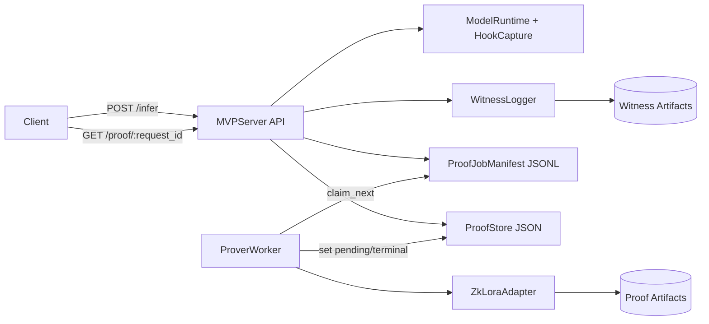
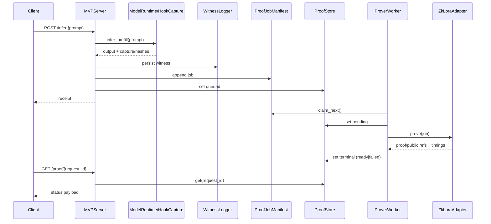
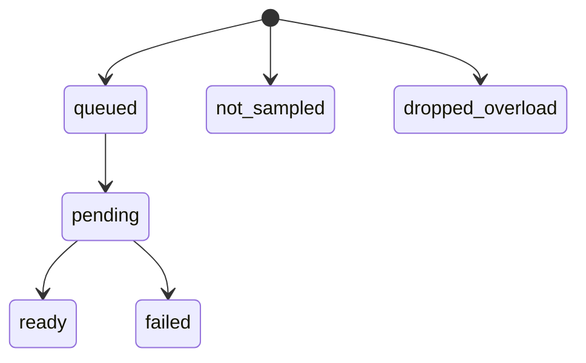

# zkLoRA × Punica MVP

This repository contains an MVP for **verifiable LoRA serving** with an asynchronous proof pipeline.

## Problem Statement
Serving a LoRA-adapted model is fast, but generating a zero-knowledge proof for that inference path is slow and operationally complex.

The MVP goal is to make this practical by:
- decoupling inference from proof generation,
- supporting bounded, reproducible benchmarking,
- testing throughput levers (threaded workers + setup cache reuse),
- and evaluating CPU vs GPU proving paths without overclaiming.

## What This Work Achieves (Phase 4b Scope)
- A benchmark harness for full-PEFT proof runs: `bench/phase4b_bounded_peft.py`.
- A threaded proof worker with configurable pool size.
- Backend intent routing (`cpu|gpu`) with explicit routing metadata.
- Strict/fallback GPU routing policy (`MVP_GPU_ROUTING_POLICY`).
- Setup-cache support for proof setup artifact reuse across runs.
- Run artifacts and summaries (`summary.json`, `summary.md`) for reproducibility.

## Current Architecture (Where It Is Today)

Flow:
1. `POST /infer` runs prefill inference and returns a receipt immediately.
2. Witness artifacts are persisted and a proof job is enqueued.
3. `ProverWorker` claims jobs and processes them with a thread pool.
4. `ZkLoraAdapter` performs export -> setup/witness/prove -> artifact collection.
5. Proof store status transitions: `queued -> pending -> ready|failed`.
6. `GET /proof/{request_id}` returns in-progress or terminal proof status.

Key files:
- `mvp_server/api/server.py`
- `mvp_server/proof/prover_worker.py`
- `mvp_server/proof/zklora_adapter.py`
- `mvp_server/config.py`
- `bench/phase4b_bounded_peft.py`

### Architecture Diagrams

#### 1) Component flow


#### 2) Request/worker sequence


#### 3) Proof status lifecycle


## Where We Are Right Now
- Architecture and harness are in place and test-covered.
- CPU throughput scaling signal exists, but reliability drops at higher thread counts.
- GPU proving trust must be re-established with strict routing validation in fresh runs.

## Environment Setup

### 1. Clone with submodules
```bash
git clone --recurse-submodules <repo-url>
cd zklora-punica-mvp
```

If you already cloned without submodules:
```bash
git submodule update --init --recursive
```

### 2. Start the dev container (local Docker path)
```bash
docker compose -f infra/docker/docker-compose.yml up -d dev
docker compose -f infra/docker/docker-compose.yml exec dev bash
cd /workspace
```

Everything below should run inside the container at `/workspace`.

### 3. Sanity check
```bash
python3 -m pytest -q mvp_server/tests
```

## Start Here (Recommended)
1. Run unit tests:
```bash
python3 -m pytest -q mvp_server/tests
```
2. Run one bounded CPU benchmark point:
```bash
python3 bench/phase4b_bounded_peft.py \
  --backends cpu \
  --threads 1 \
  --requests 1 \
  --timeout-sec 1800 \
  --request-concurrency 1 \
  --output-root /workspace/artifacts/runs \
  --gpu-routing-policy strict
```
3. Run the default matrix (CPU + GPU intents) once stable:
```bash
python3 bench/phase4b_bounded_peft.py \
  --backends cpu,gpu \
  --threads 1,2 \
  --requests 5,20 \
  --timeout-sec 900 \
  --request-concurrency 1 \
  --output-root /workspace/artifacts/runs \
  --gpu-routing-policy strict
```
4. Inspect generated run summaries:
- `/workspace/artifacts/runs/phase4b-bounded-peft-<timestamp>/summary.json`
- `/workspace/artifacts/runs/phase4b-bounded-peft-<timestamp>/summary.md`

## Important Runtime Config
- `MVP_PROVER_BACKEND=cpu|gpu`
- `MVP_GPU_ROUTING_POLICY=strict|fallback`
- `MVP_PROOF_WORKER_THREADS=<int>`
- `MVP_ARTIFACTS_ROOT=<path>`
- `MVP_INFERENCE_DEVICE=cuda|cpu`

## How To Navigate This Repository

### Top-level map
- `mvp_server/`: main MVP implementation (API surface, runtime capture, proof queue/store, worker, adapter, tests).
- `bench/`: benchmark harnesses and analysis utilities (Phase 4b runs start here).
- `infra/`: Docker and GCP scripts for local/dev cloud environments.
- `artifacts/`: generated run outputs, telemetry logs, proofs, and benchmark summaries.
- `plans/`: project docs, architecture notes, run reports, and final benchmark writeups.
- `punica/`: Punica submodule (kernel/runtime dependency source).
- `zklora/`: zkLoRA submodule (proof/export pipeline source and paper snapshot).

### If you want to...
- Understand request/proof lifecycle: start with `mvp_server/api/server.py`, then `mvp_server/proof/prover_worker.py`, then `mvp_server/proof/zklora_adapter.py`.
- Change runtime config behavior: `mvp_server/config.py` and `mvp_server/tests/test_config.py`.
- Inspect proof status/state semantics: `mvp_server/proof/proof_store.py` and `mvp_server/proof/proof_job_manifest.py`.
- Run or modify the Phase 4b benchmark: `bench/phase4b_bounded_peft.py` and `bench/README.md`.
- Validate benchmark outcomes: `plans/final-benchmark.md` plus `artifacts/runs/.../summary.json`.
- Debug GPU trust / Icicle issues: `artifacts/runs/telemetry/icicle-backtrace-*.log`.
- Work on infra or containers: `infra/docker/Dockerfile`, `infra/docker/docker-compose.yml`, and `infra/scripts/*.sh`.
- Understand external proof-library context: `zklora/readme.md` and `zklora/paper.pdf`.

### Quick orientation order (new contributor path)
1. Read this `README.md` end-to-end.
2. Run `python3 -m pytest -q mvp_server/tests`.
3. Read `mvp_server/api/server.py` and `mvp_server/proof/prover_worker.py`.
4. Run one small benchmark point with `bench/phase4b_bounded_peft.py`.
5. Open the generated `summary.json` and compare with `plans/final-benchmark.md`.

## Known Constraints
- Higher thread counts currently improve throughput but can reduce reliability.
- GPU routing confidence requires strict backend verification evidence before claiming GPU performance.
- Current MVP proof scope is `prefill_only` at one target module.

## References

### Icicle blocker (current evidence)
- Benchmark summary and trust boundary (April 23, 2026): [plans/final-benchmark.md](plans/final-benchmark.md)
- Upstream tracker: [zkonduit/ezkl issue #882](https://github.com/zkonduit/ezkl/issues/882)
- Representative panic snippet from benchmark backtraces:
```text
thread '<unnamed>' panicked at .../halo2_proofs/src/icicle.rs:28:56:
called `Result::unwrap()` on an `Err` value: UnknownError
...
halo2_proofs::poly::kzg::commitment::ParamsKZG<E>::setup
ezkl::bindings::python::__pyfunction_gen_srs
```
- Observed repeatedly across our local version sweep in this repo (April 23, 2026).

### zkLoRA paper
- In-repo paper snapshot: [zklora/paper.pdf](zklora/paper.pdf)
- Project readme paper link (arXiv): [https://arxiv.org/abs/2501.13965](https://arxiv.org/abs/2501.13965)
