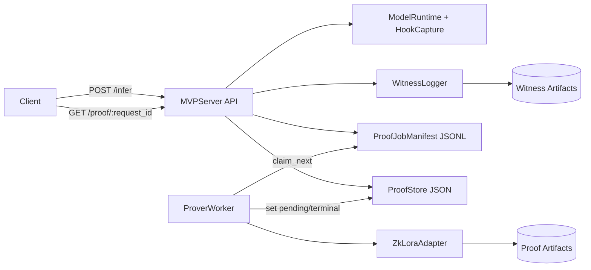

# Final Talk Slides (Requested Storyline)

Date context: April 23, 2026  
Primary numeric source: `plans/final-benchmark.md`  
Narrative style: architecture-first, evidence-first, no GPU overclaims  
Duration target: 10-12 minutes

## Slide 1 - Title + Objective
**Title:** zkLoRA-for-Serving MVP: What Works, What Does Not, and What We Can Claim

**On-slide bullets**
- Present the MVP architecture and benchmark outcomes
- Show where we reduced wall time and where we could not
- Keep claims bounded by evidence as of April 23, 2026

**Speaker notes**
- This talk is about practical engineering outcomes, not hypothetical speedups.

## Slide 2 - Background: Why This Is Relevant
**Title:** Why Proof-Aware Serving Matters

**On-slide bullets**
- Serving quality alone is not enough when verifiability is required
- We need proof artifacts without collapsing user-facing responsiveness
- The challenge is systems-level: latency, reliability, and trustable backend behavior

**Speaker notes**
- Frame this as a production systems problem, not just a cryptography problem.

## Slide 3 - Background: Quick Intro to zkLoRA
**Title:** zkLoRA in 60 Seconds

**On-slide bullets**
- zkLoRA proves statements about LoRA-adapted inference execution
- Inputs include model/witness artifacts and proving keys; outputs include proof + public artifacts
- In practice, proving is much slower than inference, so system design dominates usability

**Speaker notes**
- The key intuition: inference is fast, proving is expensive, so orchestration matters.

## Slide 4 - What Constitutes a Proof
**Title:** Major Proof-Creation Steps

**On-slide bullets**
- Export/resolve circuit artifacts
- Setup/SRS and proving material preparation
- Witness generation from captured activations
- Prove stage and artifact persistence
- Verify-ready outputs exposed by proof store status

**On-slide callout**
- Main time targets: setup and prove stages; witness is smaller but non-trivial.

## Slide 5 - Architecture Overview I (Mermaid)
**Title:** MVP Serving + Proof Component Flow

**Speaker notes**
- Walk left-to-right: inference receipt first, proving asynchronously in worker path.

## Slide 6 - Architecture Overview II (Execution Semantics)
**Title:** Lifecycle and Where Time Accumulates

**On-slide bullets**
- Status lifecycle: `queued -> pending -> ready|failed|not_sampled|dropped_overload`
- Request path is decoupled from prove path to protect inference responsiveness
- Multi-threaded proving attempts wall-time reduction across batches
- Stage timing tracked to localize bottlenecks (`setup`, `witness`, `prove`)

**Speaker notes**
- This slide bridges architecture to speedup strategy.

## Slide 7 - Speed Up Idea 1
**Title:** Multi-Thread Proving + Setup Cache Reuse

**On-slide bullets**
- Hypothesis: more prove threads reduce total wall time for request batches
- CPU benchmark matrix: threads `1,2,5,10` at `requests=20`
- Setup cache reuse applied to amortize setup cost across repeated runs
- Tradeoff observed: throughput up, reliability down at higher thread counts

**Speaker notes**
- Position this as the first practical lever inspired by zkLoRA setup amortization.

## Slide 8 - Speed Up Idea 2
**Title:** Move EZKL Proving to GPU (ezkl-gpu Path)

**On-slide bullets**
- Goal: move prove-heavy work to GPU for potential large speedups
- Engineering work: adapt original zkLoRA library flow to support `ezkl-gpu` runtime path
- Validation need: backend intent must map to effective backend (`gpu`) with trustable evidence
- Current outcome: GPU proving remains non-claimable in this benchmark cycle

**Speaker notes**
- Emphasize this was a serious attempt, but evidence is not yet sufficient for claims.

## Slide 9 - Scope of MVP + Environment Setup
**Title:** Scope and Infra Used for This Cycle

**On-slide bullets**
- Containers: `aa-zklora-cpu` and `aa-zklora-gpu`
- Offline mode required (`HF_HUB_OFFLINE=1`, `TRANSFORMERS_OFFLINE=1`)
- Benchmark harness: `bench/phase4b_bounded_peft.py` with bounded matrix
- Artifacts under `/workspace/artifacts/...` with per-run summaries and telemetry

**Speaker notes**
- The runbook in `bench/README.md` is terminal-first and reproducible.

## Slide 10 - Results 1
**Title:** CPU Wall-Time Reduction vs Threads

**On-slide table**
| threads | requests | req_per_sec | approx wall time (min) | ready_rate |
|---:|---:|---:|---:|---:|
| 1 | 20 | 0.010338 | 32.24 | 1.00 |
| 2 | 20 | 0.014695 | 22.68 | 0.95 |
| 5 | 20 | 0.017747 | 18.78 | 0.85 |
| 10 | 20 | 0.017619 | 18.92 | 0.85 |

**On-slide callout**
- Headline throughput point: `threads=5` at `0.017747 req/s`
- Reliability caveat: failures increase at higher threads (`export`-related failure class)

## Slide 11 - Results 2
**Title:** GPU vs CPU: Speedup Question and Current Answer

**On-slide table**
| pair | backend | threads | requests | req_per_sec | trust |
|---|---|---:|---:|---:|---|
| t=1 matched | cpu | 1 | 20 | 0.010043 | n/a |
| t=1 matched | gpu intent | 1 | 20 | 0.009996 | low |
| t=2 matched | cpu | 2 | 20 | 0.022152 | n/a |
| t=2 matched | gpu intent | 2 | 20 | 0.020053 | low |

**On-slide bullets**
- As of April 23, 2026, GPU proving speedup is non-claimable
- Reason: routing ambiguity and Icicle panic path block trustworthy GPU-throughput claims
- Interpretation: this is a blocker diagnosis slide, not a GPU-win slide

## Slide 12 - Blockers and Future Work
**Title:** Blockers and Next Steps

**On-slide bullets**
- Reliability: proof failures under multi-threaded runs require deeper failure taxonomy and mitigation
- GPU path: keep strict routing checks and fail-fast when effective GPU routing is unsupported
- Runtime stability: track Icicle panic behavior across versions and upstream issues
- System question: study inference/proving colocation economics given `prove_time >> request_latency`

**Speaker notes**
- Future work should prioritize claim validity before optimization claims.

## Slide 13 - Q&A
**Title:** Q&A + Backup

**On-slide bullets**
- Main message: CPU improvements are real with reliability caveats
- GPU proving remains non-claimable in this cycle
- Appendix contains run artifacts and Icicle version-sweep logs

---

## Appendix A - Artifact References
- `artifacts/runs/phase4b-bounded-peft-20260423T034102Z/summary.json`
- `artifacts/runs/telemetry/icicle-backtrace-r1-20260423T033504Z.log`
- `artifacts/runs/telemetry/icicle-backtrace-r1-ezkl15_6_2-20260423T034457Z.log`
- `artifacts/runs/telemetry/icicle-backtrace-r1-ezkl15_5_0-20260423T034710Z.log`
- `artifacts/runs/telemetry/icicle-backtrace-r1-ezkl15_4_0-20260423T034922Z.log`
- `artifacts/runs/telemetry/icicle-backtrace-r1-ezkl15_1_0-20260423T035133Z.log`

## Appendix B - Backtrace Excerpt (Slide-ready)
- Panic site: `halo2_proofs/src/icicle.rs:28:56`
- Error: `called Result::unwrap() on an Err value: UnknownError`
- Call path includes: `ParamsKZG::setup` -> `ezkl ... gen_srs`

## Appendix C - Icicle Version Sweep Snapshot
| ezkl-gpu version | outcome | status | error |
|---|---|---|---|
| 16.1.0 | failed | failed_fast | PanicException UnknownError |
| 15.6.3 | failed | failed_fast | PanicException UnknownError |
| 15.6.2 | failed | failed_fast | PanicException UnknownError |
| 15.5.0 | failed | failed_fast | PanicException UnknownError |
| 15.4.0 | failed | failed_fast | PanicException UnknownError |
| 15.1.0 | failed | failed_fast | PanicException UnknownError |

## Deck QA Checklist
- All numbers match `plans/final-benchmark.md`
- Date references use explicit date: April 23, 2026
- No slide implies validated GPU proving throughput
- Main deck keeps GPU confidence at `low`
- Rehearsal runtime: 10-12 minutes with 1-minute buffer
