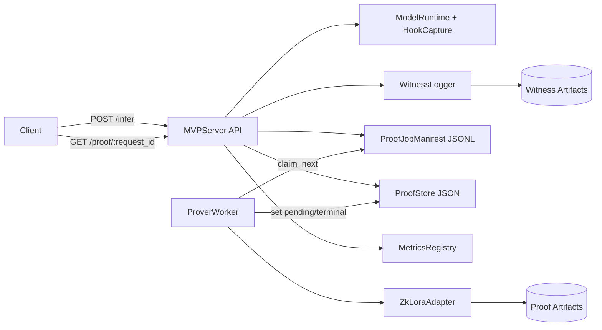
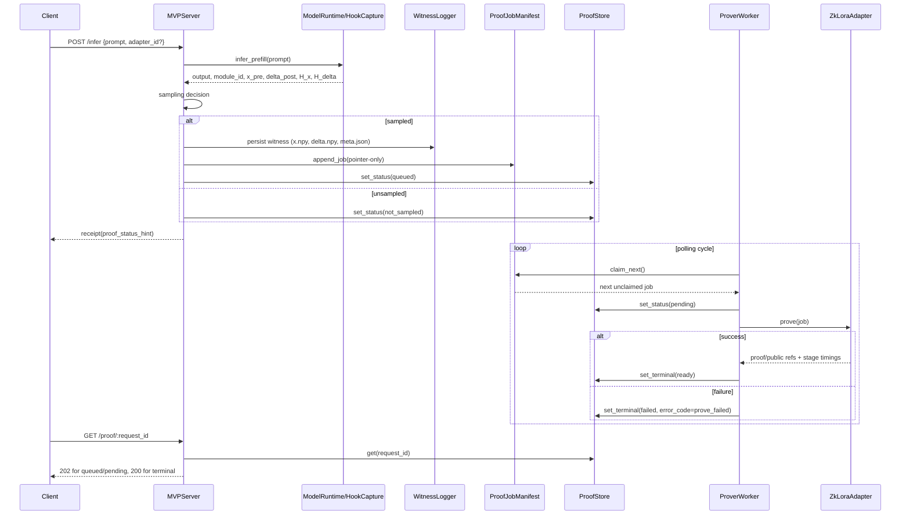
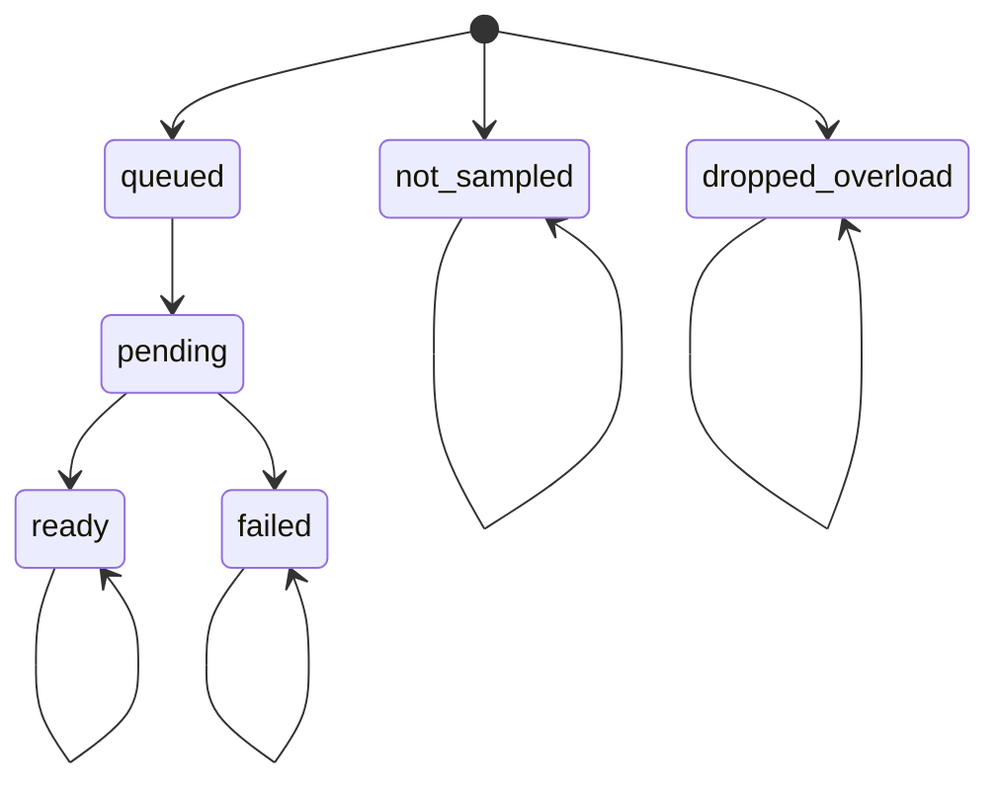
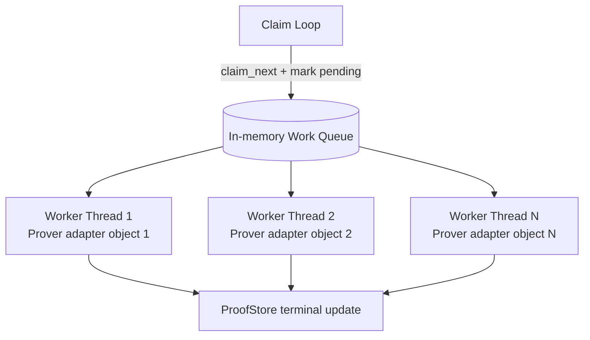

# MVP Server Architecture RFC (Current State + Near-Term Deltas)

**Status:** Draft canonical architecture reference  
**Date:** March 30, 2026  
**Audience:** Independent-study professor + engineering reviewers

## 1. Summary

This RFC documents the `mvp_server` architecture as implemented today:

- async receipt-first inference API
- durable file-backed witness + proof-job handoff
- separate prover worker with thread pool concurrency
- configurable proving backend intent (`cpu|gpu`) in adapter path

It also defines tightly scoped near-term deltas for:

1. GPU backend trust validation (is proofing actually executing on GPU?).
2. Utilization-risk measurement (cold-start vs steady-state, backend/thread isolation).

The architecture optimizes for fast iteration, reproducibility, and explicit failure semantics over distributed scale or production-grade queueing.

## 2. Context, Goals, Constraints, Non-Goals

### 2.1 Context

The project needs verifiable LoRA-serving evidence without blocking user-facing inference. The server must return quickly while proof generation runs asynchronously with durable status tracking.

### 2.2 Goals

1. Preserve inference responsiveness while enabling proof generation.
2. Maintain deterministic proof inputs (captured tensors + hash contract).
3. Provide durable, restart-safe lifecycle tracking for proof jobs.
4. Compare backend and throughput knobs (`cpu|gpu`, worker threads) without API contract churn.

### 2.3 Constraints

1. v1 keeps `prefill_only` proof scope.
2. Single configured adapter/module target in runtime path.
3. File-backed durability (`/artifacts` model) rather than external queue/database.
4. Hash schema locked to version `1`.

### 2.4 Non-Goals (This RFC)

1. Multi-node distributed queue or global scheduler.
2. Full production observability stack (Prometheus/OpenTelemetry).
3. End-to-end serving optimization beyond current architecture boundaries.
4. Broad future redesigns unrelated to current GPU trust/utilization risks.

## 3. System Overview

### 3.1 Component Architecture

Short read:
- API does inference + queueing decisions.
- Worker owns asynchronous proving lifecycle.
- File artifacts and store are the source of durable truth for handoff/state.

### 3.2 End-to-End Flow

1. Client sends `POST /infer`.
2. API validates prompt/adapter, runs prefill inference, captures `x_pre` and `delta_post`, computes hashes.
3. Sampling policy decides:
   - unsampled: `not_sampled` terminal status
   - sampled: persist witness, append proof job, set `queued`
4. Worker claims unclaimed jobs, sets `pending`, runs adapter prove path.
5. Worker writes terminal status (`ready` with artifact refs or `failed` with error metadata).
6. Client polls `GET /proof/{request_id}` until terminal.

## 4. Sequence and State Semantics

### 4.1 Request and Worker Sequence

### 4.2 Proof Status State Machine

Semantics:
- `not_sampled` and `dropped_overload` are terminal and intentionally distinct.
- Terminal self-transitions allow idempotent rewrites in same state.
- Invalid transitions are rejected by `ProofStore`.

### 4.3 Threaded Worker Concurrency Model

Concurrency intent:
- one dispatcher behavior (claim loop) to serialize manifest claims
- multiple workers consume claimed jobs
- each thread owns one prover adapter object (when factory is available)
- this does **not** imply multiple LoRA adapter IDs/models are active; current config uses a single `adapter_id` baseline

## 5. Public APIs, Interfaces, and Types

### 5.1 External API Contracts

#### `POST /infer` (`MVPServer.post_infer`)

Input (current accepted fields):
- `prompt: str` (required, non-empty)
- `adapter_id: str` (optional, must match configured adapter)
- `generation_params: dict` (optional; currently accepted but not operationally expanded)

Output:
- `output: str`
- `receipt:`
  - `request_id`
  - `adapter_id`
  - `module_id`
  - `sampled`
  - `H_x`
  - `H_delta`
  - `hash_schema_version`
  - `proof_status_hint`
  - `schema_version`

Error mapping:
- invalid prompt -> API error `400 invalid_prompt`
- adapter mismatch -> API error `400 adapter_not_allowed`

#### `GET /proof/{request_id}` (`MVPServer.get_proof`)

Returns:
- `404` + `{"status":"unknown"}` when request is absent
- `202` for non-terminal statuses (`queued`, `pending`)
- `200` for terminal statuses (`ready`, `failed`, `not_sampled`, `dropped_overload`)

Payload is `ProofRecord` fields: status, module ids, error fields, artifact refs, lifecycle timestamps.

#### `get_health` / `get_metrics`

- `get_health` exposes `status` + model load flag.
- `get_metrics` returns in-memory counters/gauges/histograms snapshot.

### 5.2 Internal Interface Contracts

#### Worker/Adapter contract

Expected proof job fields:
- `request_id`
- `module_id`
- `witness_ref`
- hash fields (`h_x`, `h_delta`, `hash_schema_version`) persisted for traceability

`ZkLoraAdapter.prove(job)` returns:
- proof artifact ref
- verification/public artifact ref
- duration
- optional stage timings (`setup`, `witness`, `prove`, `total`)

Failure contract:
- exceptions are caught by worker and mapped to terminal `failed` with `error_code=prove_failed`.

#### Core types

- `Receipt`, `WitnessRecord`, `ProofJob`, `ProofRecord` in `mvp_server/schemas.py`.
- lifecycle timestamps stored inside `ProofRecord.lifecycle_timestamps`.

## 6. Subsystem Contracts and Tradeoffs

This section is the canonical decision/tradeoff matrix.

| Subsystem | Decision | Why | Pros | Cons | Operational Risk | When To Revisit |
|---|---|---|---|---|---|---|
| Config + invariants | Strict config validation; `proof_mode`, `prover_backend`, `proof_worker_threads`, `inference_device`, hash schema locked | Keep runtime predictable and reproducible | Fewer silent misconfigs, easier benchmarking parity | Less experimentation flexibility | Runtime rejects unknown modes, requiring code edits | When expanding beyond v1 scope (multi-module, decode proofs) |
| Runtime + hook capture | Single-target hook capture at prefill; tensor canonicalization + hashing | Deterministic witness contract and immediate handoff | No re-run needed for witness persistence; deterministic hashes | Single-module proof coverage; serialization lock limits parallel inference | Hook path drift or missing capture yields request failures | When moving to multi-module capture or higher QPS inference |
| Witness persistence | Write `x.npy`, `delta.npy`, `meta.json` per sampled request/module | Durable and inspectable proof inputs | Debuggable artifacts, minimal infra dependencies | Many small files, disk pressure | I/O contention can increase request latency | When queue/load grows and storage overhead dominates |
| Manifest + claims | Append-only jobs + append-only claims logs (JSONL) | Simple durable handoff/replay model | Auditable, restart-friendly, no external broker | Claim is not transactional lock; replay cost grows with log size | Duplicate-claim race risk under multi-process patterns | When enabling multi-process workers or larger sustained queues |
| Proof store state machine | File-backed `ProofStore` with transition validation | Single source of truth for pollable lifecycle | Clear status semantics; restart-safe | Full-file rewrite on updates; single-node orientation | Heavy churn may increase write latency/contention | When moving to distributed/high-write workloads |
| Worker threading | In-process thread pool + shared queue + adapter-per-thread factory | Throughput-first improvement without API changes | Parallel proof processing; minimal architecture churn | More concurrency complexity; queue sizing tuning needed | Thread contention or uneven workloads can cap gains | When CPU/GPU utilization data suggests different concurrency model |
| Prover adapter + backend intent | Adapter supports `cpu|gpu` intent, fail-fast GPU preflight, backward-compatible prove invocation fallbacks | Enable backend A/B comparisons while handling EZKL API variance | Backend routing knob, stage timings, compatibility with differing signatures | Backend intent may not guarantee actual GPU compute without extra evidence | False confidence in GPU usage if relying on config only | Immediate revisit for backend trust-validation pipeline |
| Metrics/observability | In-memory counters/gauges/histograms via snapshot API | Lowest-friction visibility for MVP iteration | Simple and fast to add/use | Not durable; no cross-process aggregation | Limited root-cause precision for utilization bottlenecks | When moving from local diagnosis to continuous monitoring |

## 7. Failure Model and Recovery Expectations

### 7.1 Failure Semantics

1. **Input/config failures:** API rejects invalid prompt or adapter mismatch quickly.
2. **Sampling unsatisfied path:** request ends terminally as `not_sampled` (not an error).
3. **Persistence/enqueue failure:** terminal `dropped_overload` to distinguish from unsampled.
4. **Worker prove failure:** terminal `failed` with mapped `error_code`/`error_message`.
5. **GPU backend preflight failure:** when `prover_backend=gpu`, adapter fails fast if CUDA runtime unavailable.

### 7.2 Transition Guarantees

- `queued -> pending -> ready|failed` for sampled jobs that are successfully enqueued.
- terminal statuses are immutable in class (`ready`, `failed`, `not_sampled`, `dropped_overload`) except idempotent same-state writes.

### 7.3 Recovery Expectations

1. Manifest + claims + proof store on disk provide restart continuity.
2. Worker can resume scanning unclaimed jobs after restart.
3. No hard guarantee of exactly-once under adversarial multi-process claim races; current model targets practical single-worker ownership.

## 8. Implementation Parity Mapping (Quality Gate)

Major claims in this RFC map to current code:

| Behavior | Primary implementation source |
|---|---|
| API receipt-first infer flow + status hint | `mvp_server/api/server.py` |
| Threaded worker claim/process pipeline | `mvp_server/proof/prover_worker.py` |
| Backend-aware proving + stage timing capture | `mvp_server/proof/zklora_adapter.py` |
| Transition guard semantics | `mvp_server/proof/proof_store.py` |
| Manifest/claims append and claim behavior | `mvp_server/proof/proof_job_manifest.py` |
| Deterministic capture/hashing path | `mvp_server/runtime/model_runtime.py`, `hook_capture.py`, `hashing.py` |

## 9. Near-Term Deltas (Bounded to Current Risks)

### 9.1 Backend Trust Validation Architecture

Problem:
- `prover_backend=gpu` is an intent flag; intent alone is insufficient to assert proof compute is on GPU.

Near-term architecture delta:
1. **Intent evidence:** persist backend intent per run/case.
2. **Runtime preflight evidence:** capture CUDA availability and EZKL signature/capability metadata.
3. **Execution evidence:** correlate `nvidia-smi` compute PIDs with active prove process command during proof stage windows.
4. **Behavioral evidence:** compare prove-stage timing shifts against CPU control runs under fixed input.
5. **Confidence synthesis:** classify confidence only when multiple signals agree.

### 9.2 Utilization-Focused Measurement Deltas

1. Report first-proof (cold-start) separately from steady-state proofs.
2. Isolate backend effect with fixed thread count.
3. Isolate thread effect with fixed backend.
4. Collect stage-level timings (`setup`, `witness`, `prove`, `total`) for each case.
5. Mark partial vs complete matrix coverage explicitly to avoid over-claiming.

### 9.3 GPU Backend Confidence Criteria

| Confidence | Required evidence |
|---|---|
| Low | Backend intent configured, but no reliable PID correlation and no clear stage-time distinction |
| Medium | Intent + CUDA preflight + intermittent PID correlation, but timing evidence is noisy/inconclusive |
| High | Intent + stable PID correlation during prove + reproducible stage-time pattern vs CPU baseline across repeated runs |

## 10. Review Checklist (Doc Quality and Technical Correctness)

1. Every major claim is backed by implemented behavior in current modules.
2. API/status semantics in this RFC match schema/store behavior.
3. Each subsystem explicitly includes both advantages and liabilities.
4. All Mermaid diagrams match the prose and status/flow contracts.
5. A reviewer can answer:
   - Why this architecture now?
   - What risks are currently most material?
   - What evidence is needed to trust GPU backend execution?

---

This RFC is the canonical architecture reference. Existing phase/check-in docs remain historical/supporting context.
